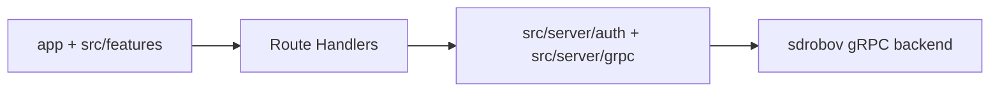

# Orbitto Auth Frontend

This repository currently implements the first vertical slice of the challenge: the `login` flow.

## How To Run

1. Install dependencies:

```bash
npm install
```

2. Copy environment variables:

```bash
cp .env.example .env.local
```

3. Start the frontend:

```bash
npm run dev
```

The frontend expects the selected backend to be available at `AUTH_GRPC_ENDPOINT`.

## Selected Backend

- Backend fork: [sdrobov/atlantis-engineer-challenge](https://github.com/sdrobov/atlantis-engineer-challenge)
- Pinned backend commit: `a4a384107169f95b8873850c6d5a2700248bd156`
- Vendored proto source: `api/proto/auth/v1/auth.proto`

## Current Scope

Implemented:

- `/login`
- `POST /api/auth/login`
- `GET /api/session/me`
- `POST /api/auth/logout`
- minimal `/account` post-login stub
- route stubs for `/register` and `/forgot-password`
- static auth illustration based on the provided Figma export

Not implemented in this stage:

- registration flow
- forgot-password flow
- reset-password flow
- refresh orchestration

## Frontend Architecture



- `app/` owns routes, layouts, and route handlers
- `src/features/` owns screen-specific logic and form orchestration
- `src/shared/ui/` owns reusable primitives and auth layout
- `src/server/` owns gRPC transport, cookies, and BFF logic

## Contract Assumptions

| Area | Assumption |
| --- | --- |
| Transport | The backend is reachable over gRPC from the Next.js Node runtime |
| Auth login | `AuthCommandService.Login` returns access and refresh tokens with expiry timestamps |
| Session lookup | `AuthQueryService.GetUserByEmail` is used with `orbitto_session_email` + bearer auth token |
| Forgot password | Not implemented yet, but later backend `NotFound` will be normalized at the BFF layer |

## Accepted Trade-Offs

| Decision | Why |
| --- | --- |
| Next.js App Router | One repo for UI, BFF, cookies, and server-side gRPC |
| Explicit BFF via Route Handlers | Clear transport boundary and simpler auth/session ownership |
| Buf codegen | Typed contract snapshot pinned to a backend commit |
| CSS Modules + tokens | Keeps styling local and predictable without utility sprawl |
| Static illustration asset | Matches the provided auth layout without adding runtime animation or extra rendering cost |
| No global store | Login slice only needs local form state and server-managed session cookies |

## Test Instructions

Run unit tests:

```bash
npm run test:unit
```

Run e2e tests:

```bash
npm run test:e2e
```

Run all checks expected for this stage:

```bash
npm run lint
npm run typecheck
npm run build
npm run test:unit
npm run test:e2e
```

## Reviewer Demo Script

1. Start the selected backend locally.
2. Start this frontend with `npm run dev`.
3. Open `/login`.
4. Try an invalid login to see the invalid-credentials state.
5. Use valid backend credentials to reach `/account`.
6. Use `Logout` to return to `/login`.

## Demo Link Or Screencast

Not available yet.

## Next Production Steps

- implement register and password recovery flows
- add refresh orchestration
- expand session handling and route protection
- add richer frontend observability for auth failures
